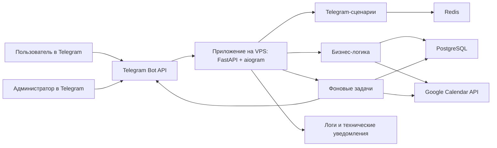

# Стек используемых технологий

Документ подготовлен на основании файла `1. Техническое задание.md`.

Здесь хранится согласованный технологический стек проекта, сравнение с альтернативами, архитектура MVP и рекомендуемая конфигурация VPS.

## 1. Как выбирался стек технологий

Стек выбран под конкретные условия проекта:

1. Вы не пишете код вручную, а работаете с помощью ИИ.
2. MVP должен быть Telegram-чат-ботом без Mini App и без веб-админки.
3. В будущем нужен Mini App, поэтому нельзя делать одноразовую архитектуру только под Telegram.
4. Нужна интеграция с Google Calendar.
5. Нужны заявки, статусы, резервы слотов, настройки, история и логи.
6. Система будет размещаться на VPS.
7. Ошибки должны быстро находиться по логам.
8. Проект должен удобно дорабатываться этапами.

Главный принцип выбора: не самый сложный и не самый модный стек, а тот, который быстрее доведет MVP до рабочего состояния и не создаст тупик для Mini App.

---

## 2. Рекомендуемый стек

| Зона | Рекомендация | Почему |
|---|---|---|
| Язык | Python 3.12+ | Хорошо подходит для ботов, backend, интеграций и разработки с ИИ |
| Telegram-бот | aiogram 3.x | Удобен для сложных многошаговых сценариев, кнопок, состояний и webhook |
| Backend | FastAPI | Нужен для webhook, health-check, будущего Mini App и технического API |
| База данных | PostgreSQL | Надежно хранит заявки, статусы, настройки, резервы и историю |
| Работа с базой | SQLAlchemy | Стандартный способ работать с PostgreSQL в Python |
| Миграции | Alembic | Позволяет безопасно менять структуру базы |
| Состояния бота и лимиты | Redis | Удобен для временных состояний, защиты от спама и краткоживущих данных |
| Фоновые задачи | APScheduler | Достаточно прост для MVP: TTL резервов, напоминания, проверки |
| Google Calendar | Google Calendar API | Официальный способ читать занятость и создавать события |
| Конфигурация | Переменные окружения | Секреты не хранятся в коде |
| Запуск на VPS | Docker Compose | Упрощает запуск приложения, базы и Redis на сервере |
| HTTPS / webhook | Caddy или Nginx | Нужны для безопасного приема webhook от Telegram |
| Тесты | pytest | Автоматическая проверка бизнес-правил |
| Проверка кода | ruff | Быстрая проверка качества Python-кода |
| Логи | Структурированные логи | Удобная диагностика проблем |

---

## 3. Сравнение вариантов технологий

### 3.1. Язык разработки

| Вариант | Плюсы | Минусы | Вывод |
|---|---|---|---|
| Python | Прост для чтения, хорошо поддерживается ИИ, много библиотек для Telegram и Google, быстрый MVP | Нужно аккуратно следить за типами и структурой проекта | Рекомендован |
| TypeScript / Node.js | Хорош для будущего Mini App, строгие типы, много web-инструментов | Для Telegram-бота и Google-интеграции MVP может получиться более шумным по настройке | Хорош, если сразу делать Mini App |
| Go | Быстрый и надежный | Сложнее для быстрой разработки с ИИ и многошагового bot-flow | Не нужен для этого MVP |

Рекомендация: Python. Проект интеграционный и сценарный, а не высоконагруженный. Для нас важнее скорость разработки, понятность и проверяемость.

### 3.2. Telegram framework

| Вариант | Плюсы | Минусы | Вывод |
|---|---|---|---|
| aiogram 3.x | Асинхронный, удобные роутеры, состояния, хорошо подходит для сложных диалогов | Нужно аккуратно проектировать состояния | Рекомендован |
| python-telegram-bot | Популярный и понятный | Для сложного сценария с состояниями может быть менее удобен | Возможен, но aiogram лучше под наш flow |
| Telegraf / grammY | Хорошие варианты для Node.js | Потребуют перехода на TypeScript/Node.js | Не выбираем при Python backend |

Рекомендация: aiogram 3.x. В боте будет много шагов: длительность, неделя, дата, слот, данные, согласие, резюме, изменение заявки. Для этого нужна удобная работа с состояниями.

### 3.3. Backend

| Вариант | Плюсы | Минусы | Вывод |
|---|---|---|---|
| FastAPI | Легкий, современный, удобен для webhook, health-check и будущего Mini App | Нужно аккуратно организовать структуру проекта | Рекомендован |
| Django | Много готового, есть админка | Для MVP Telegram-бота тяжеловат, больше лишней структуры | Не нужен сейчас |
| Flask | Очень простой | Для будущего Mini App и роста проекта менее удобен | Можно, но FastAPI лучше |
| Только bot process | Быстро на старте | Потом сложнее добавить Mini App, health-check и нормальный deploy | Не рекомендован |

Рекомендация: FastAPI. Даже если пользовательский интерфейс только Telegram, серверу нужен webhook, проверка здоровья и основа для будущего Mini App.

### 3.4. База данных

| Вариант | Плюсы | Минусы | Вывод |
|---|---|---|---|
| PostgreSQL | Надежная, подходит для статусов, истории, резервов, параллельных действий и Mini App | Нужно запускать отдельный сервис | Рекомендована |
| SQLite | Очень простая, не нужен отдельный сервер базы | Хуже для параллельных действий, VPS и будущего Mini App | Только для чернового прототипа |
| MySQL | Надежная база | Для Python-проекта с такими задачами PostgreSQL обычно удобнее | Можно, но нет причины выбирать вместо PostgreSQL |
| Google Sheets | Наглядно и просто | Это не база данных: хуже с надежностью, статусами, резервами, параллельностью | Не подходит как основное хранилище |

Рекомендация: PostgreSQL. У нас есть резервы слотов и статусы заявок. Это нужно хранить надежно.

### 3.5. Redis

| Вариант | Плюсы | Минусы | Вывод |
|---|---|---|---|
| Redis | Хорош для состояний диалога, лимитов, временных данных | Еще один сервис в Docker Compose | Рекомендован |
| Только PostgreSQL | Меньше компонентов | Больше технического кода для временных состояний | Допустимо для упрощения |

Рекомендация: Redis оставить в архитектуре. Если на старте захочется максимально упростить, можно временно хранить состояния в PostgreSQL, но для Telegram-бота с многошаговой навигацией Redis полезен.

### 3.6. Фоновые задачи

| Вариант | Плюсы | Минусы | Вывод |
|---|---|---|---|
| APScheduler | Просто встроить в MVP, достаточно для напоминаний и TTL | Не такой мощный, как отдельная очередь задач | Рекомендован |
| Celery/RQ | Мощные очереди задач | Сложнее настройка и эксплуатация | Можно позже |
| cron | Просто для регулярных команд | Неудобно для логики заявок и уведомлений внутри приложения | Не основной вариант |

Рекомендация: APScheduler для MVP. Нам нужны понятные задачи: напомнить через 12 часов, напомнить за 2 часа, закрыть истекший резерв.

### 3.7. Размещение

| Вариант | Плюсы | Минусы | Вывод |
|---|---|---|---|
| Docker Compose на VPS | Все под контролем, удобно запускать приложение, базу и Redis вместе | Нужно настроить сервер | Рекомендован |
| Serverless | Не нужно администрировать сервер | Telegram webhook, фоновые задачи и Google OAuth могут быть сложнее | Не лучший вариант для новичка |
| Managed cloud | Надежно и удобно | Может быть дороже и сложнее для старта | Можно позже |

Рекомендация: Docker Compose на VPS. Вы уже планируете дать доступ к VPS, поэтому это самый прямой путь.

---

## 4. Решения, которые нужно согласовать

Моя рекомендация:

1. MVP делаем как Telegram-чат-бот без Mini App и веб-админки.
2. Язык: Python.
3. Telegram: aiogram.
4. Backend: FastAPI.
5. База: PostgreSQL.
6. Временные состояния: Redis.
7. Фоновые задачи: APScheduler.
8. Google: официальный Google Calendar API.
9. Запуск на сервере: Docker Compose на VPS.

Компромисс, если хочется упростить самый первый запуск:

1. Оставить Python, aiogram, FastAPI и PostgreSQL.
2. Redis подключить сразу или добавить чуть позже.
3. Mini App не делать в MVP.

### 4.1. Статус согласования

Решение согласовано: используем Python, aiogram, FastAPI, PostgreSQL, Redis, APScheduler, Google Calendar API и Docker Compose.

### 4.2. Рекомендуемая конфигурация VPS

Проект не требует дорогого сервера. В MVP ожидается низкая нагрузка: один владелец календаря, ограниченное число пользователей, Telegram webhook, PostgreSQL, Redis, фоновые задачи и интеграция с Google Calendar.

Минимальная конфигурация для теста и очень небольшого использования:

1. CPU: 1 vCPU.
2. RAM: 1 GB.
3. Диск: 20 GB SSD.
4. ОС: Ubuntu 22.04 LTS или Ubuntu 24.04 LTS.
5. Swap: 1-2 GB.

Рекомендуемая конфигурация для спокойного MVP:

1. CPU: 1 vCPU.
2. RAM: 2 GB.
3. Диск: 30-40 GB SSD.
4. ОС: Ubuntu 22.04 LTS или Ubuntu 24.04 LTS.
5. Swap: 1-2 GB.
6. Статический IPv4.
7. Домен или поддомен для HTTPS webhook.

Конфигурация на вырост для Mini App и более активного использования:

1. CPU: 2 vCPU.
2. RAM: 4 GB.
3. Диск: 60 GB SSD.
4. ОС: Ubuntu 24.04 LTS.

Рекомендация для первого запуска: 1 vCPU, 2 GB RAM, 30-40 GB SSD. Это не дорогая конфигурация, но она заметно спокойнее, чем 1 GB RAM, потому что на сервере одновременно будут приложение, PostgreSQL, Redis, reverse proxy и фоновые задачи.

При выборе VPS важно проверить:

1. Сервер должен иметь стабильный доступ к Telegram API.
2. Сервер должен иметь стабильный доступ к Google Calendar API.
3. Должна быть возможность открыть HTTPS endpoint для Telegram webhook.
4. Желательно иметь простой доступ по SSH.

---

## 5. Архитектура MVP

### 5.1. Как должны разделяться части проекта

1. Telegram-сценарии отвечают за сообщения, кнопки и навигацию.
2. Бизнес-логика отвечает за правила: слоты, резервы, статусы, ограничения.
3. Google-интеграция отвечает только за календарь.
4. База данных хранит заявки, пользователей, настройки и историю.
5. Фоновые задачи отвечают за напоминания и истечение резервов.
6. Логи помогают быстро понять, что произошло.

Важно: Telegram-сценарии не должны быть единственным местом, где живут правила проекта. Иначе Mini App потом придется делать почти заново.

---

---

## 14. Документация для разработки

При реализации нужно сверяться с актуальной документацией:

1. aiogram: https://docs.aiogram.dev/
2. FastAPI: https://fastapi.tiangolo.com/
3. Google Calendar API: https://developers.google.com/calendar/api
4. Telegram Bot API: https://core.telegram.org/bots/api
5. PostgreSQL: https://www.postgresql.org/docs/
6. Redis: https://redis.io/docs/latest/
7. Docker Compose: https://docs.docker.com/compose/

---
