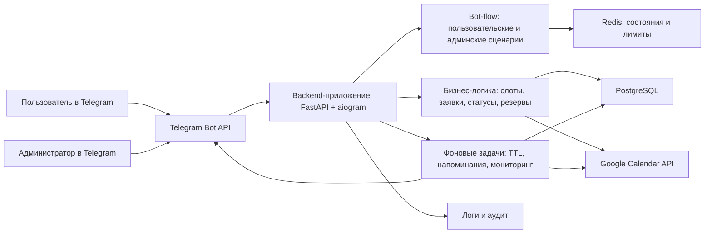

# Этапы разработки

# Telegram-бот для согласования встреч и записи в Google Calendar

Документ подготовлен на основании файла `ТЗ_Telegram_Google_Calendar_Bot_v1.1.md`.

Цель документа: заранее согласовать архитектуру, технологии и порядок разработки MVP, чтобы дальше двигаться по понятным этапам, проверять результат после каждого этапа и быстро находить ошибки по логам.

Код на этом этапе не пишется. Этот документ является подготовительным планом для последующей разработки.

---

## 1. Готовый промпт для следующих задач

Этот промпт можно использовать перед началом реализации каждого этапа.

```text
Ты - senior backend-разработчик и архитектор. Мы разрабатываем MVP Telegram-бота для записи на консультации и согласования встреч с интеграцией Google Calendar.

Основной документ требований: ТЗ_Telegram_Google_Calendar_Bot_v1.1.md.
План этапов: Этапы разработки.md.

Работай строго по согласованному этапу. Не перескакивай к следующим этапам без необходимости.

Перед началом:
1. Прочитай актуальное ТЗ и план этапов.
2. Кратко напиши, какие файлы и модули будешь менять.
3. Если есть неоднозначность, предложи 2-3 варианта и рекомендацию.

Во время работы:
1. Делай изменения небольшими логичными блоками.
2. Добавляй логирование для ключевых действий, ошибок и внешних интеграций.
3. Не храни токены, пароли и секреты в коде.
4. Не удаляй чужие изменения без явного разрешения.

После завершения этапа:
1. Запусти автоматические проверки, которые возможны локально.
2. Проверь логи и отсутствие критических ошибок.
3. Напиши, что именно проверено автоматически.
4. Если без владельца проекта проверить нельзя, дай простую пошаговую инструкцию для новичка.
5. Укажи измененные файлы.
6. Укажи остаточные риски и что будет проверяться на следующих этапах.
```

---

## 2. Рекомендуемая стратегия MVP

### 2.1. Рекомендация

Для первого релиза лучше делать только Telegram-чат-бот без Mini App и без веб-админки.

Это оптимальный MVP, потому что:

1. Основная сложность проекта находится в правилах расписания, статусах заявок, резервировании слотов и интеграции с Google Calendar.
2. Telegram-интерфейса достаточно для пользователя и администратора на первом запуске.
3. Разработка будет быстрее и дешевле.
4. Пользователь сразу работает в привычном Telegram.
5. После реального использования будет понятно, какие элементы действительно стоит переносить в Mini App.

### 2.2. Важное архитектурное условие

Даже если Mini App не делается в MVP, архитектуру нужно строить так, чтобы Mini App можно было добавить позже без переписывания всей системы.

Для этого:

1. Бизнес-правила должны жить отдельно от Telegram-сценариев.
2. Данные должны храниться в нормальной базе данных.
3. Google Calendar должен быть отдельным интеграционным модулем.
4. Telegram-бот должен быть только одним из интерфейсов к общей логике.
5. Для будущего Mini App нужно заранее иметь backend API или возможность легко его добавить.

---

## 3. Технологии на согласование

### 3.1. Рекомендованный стек

| Зона | Технология | Зачем нужна |
|---|---|---|
| Язык разработки | Python 3.12+ | Подходит для Telegram-ботов, backend-сервисов, интеграций и быстрой разработки MVP |
| Telegram-бот | aiogram 3.x | Современная асинхронная библиотека для Telegram Bot API, поддерживает роутеры, состояния и webhook |
| Backend API | FastAPI | Нужен для webhook, health-check, будущего Mini App и технических API |
| База данных | PostgreSQL | Надежное хранение заявок, пользователей, настроек, резервов и истории |
| Работа с базой | SQLAlchemy | Удобный слой работы с базой данных |
| Миграции базы | Alembic | Управление изменениями структуры базы |
| Временные состояния и лимиты | Redis | Хранение FSM-состояний бота, rate limit, краткоживущих технических данных |
| Фоновые задачи | APScheduler или отдельный worker | Напоминания, истечение резервов, технические периодические проверки |
| Google Calendar | Google Calendar API через официальный Python-клиент | Чтение занятости календаря и создание событий |
| Конфигурация | env-файлы и переменные окружения | Безопасное хранение настроек без записи секретов в код |
| Контейнеризация | Docker Compose | Простой запуск на VPS: приложение, база, Redis, reverse proxy |
| Reverse proxy / HTTPS | Caddy или Nginx | HTTPS и прием webhook от Telegram |
| Тестирование | pytest | Автоматическая проверка бизнес-логики |
| Линтинг и форматирование | ruff | Быстрая проверка качества Python-кода |
| Логи | structured logging | Понятные логи для диагностики ошибок |

### 3.2. Почему не SQLite для MVP

SQLite проще, но для этого проекта лучше сразу взять PostgreSQL, потому что:

1. Есть заявки, резервы, статусы и история.
2. Будут фоновые задачи и возможные параллельные действия.
3. В будущем появится Mini App.
4. PostgreSQL лучше подходит для VPS и нормальной эксплуатации.

### 3.3. Почему нужен FastAPI, даже если MVP только Telegram-бот

FastAPI полезен уже в MVP:

1. Принимать Telegram webhook.
2. Сделать технический health-check.
3. Подготовить основу для будущего Mini App.
4. Упростить диагностику на сервере.

### 3.4. Почему Redis лучше заложить сразу

Redis не является главным хранилищем данных. Главные данные должны быть в PostgreSQL.

Redis нужен для:

1. Состояний многошагового диалога в Telegram.
2. Ограничений от спама.
3. Кратковременных технических данных.

Если нужно упростить MVP, Redis можно временно заменить хранением состояний в PostgreSQL, но рекомендация - оставить Redis в архитектуре.

### 3.5. Решения, которые нужно согласовать перед стартом разработки

Рекомендованные решения:

1. MVP делаем только как Telegram-чат-бот.
2. Backend пишем на Python.
3. Используем aiogram 3.x для Telegram.
4. Используем FastAPI для webhook и будущего API.
5. Используем PostgreSQL как основную базу данных.
6. Используем Redis для состояний, лимитов и технических задач.
7. Размещаем на VPS через Docker Compose.
8. Mini App делаем вторым этапом после проверки MVP.

---

## 4. Общая архитектура

### 4.1. Компоненты системы



### 4.2. Основные слои

1. Интерфейс Telegram: сообщения, кнопки, навигация, админские действия.
2. Backend API: webhook, health-check, будущие endpoints для Mini App.
3. Бизнес-логика: расчет слотов, статусы заявок, резервы, ограничения.
4. Интеграции: Google Calendar, Telegram API.
5. Данные: PostgreSQL, Redis.
6. Фоновые задачи: напоминания, истечение резервов, повторные проверки.
7. Наблюдаемость: логи, технические уведомления, аудит действий.

### 4.3. Принцип проектирования

Telegram-бот не должен содержать всю бизнес-логику внутри обработчиков сообщений.

Правильная схема:

1. Telegram-сценарий принимает действие пользователя.
2. Передает команду в бизнес-логику.
3. Бизнес-логика проверяет правила и меняет данные.
4. Telegram-сценарий только показывает результат пользователю.

Так Mini App в будущем сможет использовать ту же бизнес-логику.

---

## 5. Логирование: общее правило для всех этапов

Логи нужны с первого этапа, а не в конце.

### 5.1. Что логировать всегда

1. Старт и остановку приложения.
2. Ошибки Telegram API.
3. Ошибки Google Calendar API.
4. Создание заявки.
5. Изменение заявки.
6. Отмену заявки.
7. Согласование заявки.
8. Отклонение заявки.
9. Создание события в Google Calendar.
10. Истечение резерва.
11. Отправку напоминаний.
12. Изменение настроек администратором.
13. Блокировку и разблокировку пользователей.

### 5.2. Что нельзя писать в логи

1. Токен Telegram-бота.
2. Google OAuth token.
3. Пароли.
4. Полные секретные ссылки.
5. Избыточные персональные данные.

Можно писать ID заявки, Telegram ID, статус, тип действия, техническую ошибку и время события.

### 5.3. Где смотреть логи

На локальном этапе:

1. В консоли запуска приложения.
2. В тестовых отчетах.

На VPS:

1. Через логи Docker-контейнера.
2. Через отдельный лог-файл, если он будет настроен.
3. Через технические уведомления администратору в Telegram.

---

## 6. Этапы разработки

## Этап 0. Согласование архитектуры и подготовка доступов

### Цель

Зафиксировать стек, архитектуру, MVP-границы и список доступов, которые понадобятся позже.

### Что делаем

1. Утверждаем стек: Python, aiogram, FastAPI, PostgreSQL, Redis, Google Calendar API, Docker Compose.
2. Утверждаем MVP: Telegram-бот без Mini App и без веб-админки.
3. Утверждаем, что Mini App будет вторым этапом.
4. Фиксируем, какие секреты понадобятся:
   - Telegram bot token;
   - Telegram ID администратора;
   - Google OAuth credentials;
   - доступ к VPS;
   - домен или технический адрес для webhook.
5. Фиксируем, какие значения будут настройками:
   - рабочие дни;
   - рабочие часы;
   - буфер;
   - горизонт записи;
   - лимит встреч;
   - тексты уведомлений.

### Логи на этапе

Кода еще нет, но в плане фиксируем обязательные будущие события логирования:

1. Старт приложения.
2. Подключение к базе.
3. Подключение к Redis.
4. Получение webhook.
5. Ошибки Telegram.
6. Ошибки Google.

### Как я проверяю

1. Сверяю этот документ с ТЗ.
2. Проверяю, что MVP не содержит Mini App и веб-админку.
3. Проверяю, что все будущие требования ТЗ покрыты этапами разработки.
4. Проверяю, что для каждого этапа есть критерии готовности.

### Как проверяете вы

1. Открываете этот файл.
2. Смотрите раздел "Технологии на согласование".
3. Если все понятно, пишете: "Стек согласован".
4. Если что-то смущает, пишете простыми словами: "Не понимаю, зачем Redis" или "Не хочу PostgreSQL", и мы отдельно разберем.

### Критерий готовности

Этап готов, когда согласованы:

1. MVP-границы.
2. Технологии.
3. Общая архитектура.
4. Список будущих доступов.

---

## Этап 1. Каркас проекта и локальная инфраструктура

### Цель

Создать техническую основу проекта, на которой можно безопасно развивать бота.

### Что делаем

1. Создаем структуру проекта.
2. Настраиваем приложение FastAPI.
3. Подключаем aiogram как Telegram-слой.
4. Добавляем конфигурацию через переменные окружения.
5. Добавляем Docker Compose для приложения, PostgreSQL и Redis.
6. Добавляем базовый health-check.
7. Добавляем базовое логирование.
8. Добавляем команды для локального запуска.
9. Добавляем базовые проверки качества кода.

### Логи на этапе

Добавить логи:

1. Приложение запущено.
2. Приложение остановлено.
3. Конфигурация загружена без показа секретов.
4. Подключение к PostgreSQL успешно.
5. Подключение к Redis успешно.
6. Health-check вызван.
7. Ошибка подключения к базе.
8. Ошибка подключения к Redis.

### Как я проверяю

1. Запускаю проект локально.
2. Проверяю, что приложение стартует без ошибок.
3. Проверяю, что health-check возвращает успешный ответ.
4. Проверяю, что база данных доступна.
5. Проверяю, что Redis доступен.
6. Проверяю, что логи появляются в консоли.
7. Запускаю линтер и базовые тесты.

### Как проверяете вы

На этом этапе вам, скорее всего, ничего не нужно делать.

Если понадобится ручная проверка:

1. Я дам вам одну ссылку вида `http://localhost:.../health`.
2. Вы откроете ее в браузере.
3. Если увидите сообщение вроде `ok`, значит приложение живое.
4. Если увидите ошибку, пришлете мне текст ошибки или скриншот.

### Критерий готовности

Этап готов, если:

1. Проект запускается локально.
2. Health-check работает.
3. PostgreSQL подключается.
4. Redis подключается.
5. Логи видны.
6. Базовые проверки проходят.

---

## Этап 2. Модель данных и миграции

### Цель

Создать надежное хранилище для пользователей, заявок, настроек, резервов, событий календаря и истории действий.

### Что делаем

1. Проектируем таблицы базы данных.
2. Создаем миграции.
3. Добавляем начальные настройки по умолчанию:
   - все дни недели;
   - 10:00-18:00;
   - длительности 15, 30, 45, 90 минут;
   - буфер 60 минут;
   - максимум 3 консультации в день;
   - горизонт записи 28 дней;
   - часовой пояс Asia/Yekaterinburg.
4. Добавляем хранение статусов заявок.
5. Добавляем хранение истории изменений.
6. Добавляем хранение Google Calendar event ID и ссылки на событие.
7. Добавляем хранение согласия на обработку персональных данных.

### Основные сущности

1. Пользователь.
2. Заявка.
3. Настройки расписания.
4. Запрещенные даты и периоды.
5. Резерв слота.
6. Событие Google Calendar.
7. История статусов.
8. Аудит действий администратора.
9. Технические ошибки интеграций.

### Логи на этапе

Добавить логи:

1. Миграция базы применена.
2. Начальные настройки созданы.
3. Создан пользователь.
4. Создана заявка.
5. Изменен статус заявки.
6. Создан резерв.
7. Освобожден резерв.
8. Ошибка записи в базу.

### Как я проверяю

1. Запускаю миграции на пустой базе.
2. Проверяю, что все таблицы созданы.
3. Проверяю, что начальные настройки появились.
4. Создаю тестовую заявку через технический тест.
5. Проверяю, что статус и история сохраняются.
6. Проверяю, что миграции можно применить повторно без поломки.
7. Запускаю тесты модели данных.

### Как проверяете вы

Обычно ручная проверка не нужна.

Если понадобится показать результат:

1. Я пришлю вам короткий список созданных таблиц.
2. Вам достаточно проверить, что в списке есть понятные сущности: пользователи, заявки, настройки, резервы, события.
3. Код или базу данных открывать не нужно.

### Критерий готовности

Этап готов, если:

1. База создается автоматически.
2. Все основные сущности есть.
3. Начальные настройки сохранены.
4. Заявка может пройти базовый жизненный цикл в базе.
5. История статусов сохраняется.
6. Ошибки базы логируются.

---

## Этап 3. Backend-ядро и бизнес-логика без Telegram и Google

### Цель

Сначала реализовать правила проекта отдельно от интерфейса Telegram и реального Google Calendar.

Это важно, потому что такие правила проще тестировать автоматически.

### Что делаем

1. Реализуем статусы заявки.
2. Реализуем расчет недель для выбора дат.
3. Реализуем правила навигации:
   - текущая неделя;
   - следующая неделя;
   - предыдущая неделя;
   - ограничение горизонтом записи.
4. Реализуем расчет доступных слотов на основании тестовых занятых интервалов.
5. Реализуем правило минимального времени до встречи: 2 часа.
6. Реализуем рабочие часы 10:00-18:00.
7. Реализуем буфер 60 минут.
8. Реализуем лимит 3 консультации в день.
9. Реализуем резервирование слота.
10. Реализуем TTL резерва 24 часа.
11. Реализуем изменение и отмену заявки до согласования.
12. Реализуем запрос на удаление данных.

### Логи на этапе

Добавить логи:

1. Расчет слотов начат.
2. Расчет слотов завершен.
3. Свободные слоты не найдены.
4. Слот зарезервирован.
5. Резерв истек.
6. Заявка изменена.
7. Заявка отменена.
8. Нарушено бизнес-правило, например превышен лимит встреч.

### Как я проверяю

1. Запускаю автоматические тесты на расчет слотов.
2. Проверяю кейс: встреча на 15 минут.
3. Проверяю кейс: встреча на 90 минут.
4. Проверяю кейс: буфер 60 минут.
5. Проверяю кейс: меньше 2 часов до встречи.
6. Проверяю кейс: больше 3 встреч в день.
7. Проверяю кейс: текущая неделя начинается с понедельника.
8. Проверяю кейс: переход на следующую неделю.
9. Проверяю кейс: выход за горизонт записи невозможен.
10. Проверяю кейс: пользователь меняет длительность, дата и слот сбрасываются.
11. Проверяю кейс: пользователь меняет дату, слот сбрасывается.
12. Проверяю логи тестовых ошибок.

### Как проверяете вы

На этом этапе пользовательского интерфейса еще может не быть, поэтому ручная проверка обычно не нужна.

Я должен показать вам понятный отчет:

1. Сколько тестов прошло.
2. Какие бизнес-правила проверены.
3. Есть ли ошибки.
4. Какие сценарии остаются для проверки в Telegram.

### Критерий готовности

Этап готов, если:

1. Все бизнес-правила из ТЗ покрыты тестами.
2. Расчет слотов работает на тестовых данных.
3. Статусы заявки работают.
4. Резервирование работает.
5. Навигация по неделям работает.
6. Логи помогают понять, почему слот доступен или недоступен.

---

## Этап 4. Bot-flow пользователя

### Цель

Собрать пользовательский сценарий в Telegram: от входа по ссылке до отправки заявки.

### Что делаем

1. Реализуем старт бота.
2. Реализуем проверку постоянной ссылки-приглашения.
3. Реализуем сообщение для пользователя без приглашения.
4. Реализуем выбор типа встречи "Консультация".
5. Реализуем выбор длительности.
6. Реализуем недельный выбор дат.
7. Реализуем переключение недель.
8. Реализуем выбор свободного слота.
9. Реализуем ввод имени, телефона, email и цели.
10. Реализуем кнопку согласия на обработку персональных данных.
11. Реализуем финальное резюме заявки.
12. Реализуем навигацию назад и вперед.
13. Реализуем историю заявок.
14. Реализуем изменение заявки до согласования.
15. Реализуем отмену заявки до согласования.

### Логи на этапе

Добавить логи:

1. Пользователь начал сценарий записи.
2. Пользователь пришел без приглашения.
3. Пользователь выбрал длительность.
4. Пользователь выбрал неделю.
5. Пользователь выбрал дату.
6. Пользователь выбрал слот.
7. Пользователь вернулся назад.
8. Пользователь изменил ранее выбранный параметр.
9. Пользователь ввел некорректный email.
10. Пользователь подтвердил согласие.
11. Пользователь отправил заявку.
12. Ошибка отправки сообщения пользователю.

### Как я проверяю

1. Запускаю автоматические тесты обработчиков, если они предусмотрены.
2. Проверяю, что пользовательский сценарий не падает на каждом шаге.
3. Проверяю, что кнопка "Назад" работает на всех нужных шагах.
4. Проверяю, что при смене длительности сбрасываются дата и слот.
5. Проверяю, что при смене даты сбрасывается слот.
6. Проверяю, что email валидируется.
7. Проверяю, что без согласия заявка не создается.
8. Проверяю, что заявка появляется в базе.
9. Проверяю логи пользовательского сценария.

### Как проверяете вы

Здесь нужна ваша ручная проверка в Telegram.

Пошагово:

1. Я дам вам ссылку на тестового бота.
2. Вы откроете ссылку в Telegram.
3. Нажмете "Записаться на консультацию".
4. Выберете длительность 30 минут.
5. Посмотрите, что появились даты текущей недели.
6. Нажмете "Следующая неделя".
7. Нажмете "Предыдущая неделя".
8. Выберете дату.
9. Выберете слот.
10. Нажмете "Назад" и попробуете поменять дату.
11. Потом снова выберете слот.
12. Заполните имя, телефон, email и цель.
13. Попробуете сначала ввести неправильный email.
14. Потом введете правильный email.
15. Подтвердите согласие.
16. Отправите заявку.
17. Проверите, что бот написал, что заявка отправлена.
18. Откроете историю заявок.
19. Попробуете изменить заявку.
20. Попробуете отменить тестовую заявку.

### Критерий готовности

Этап готов, если:

1. Пользователь может пройти сценарий до создания заявки.
2. Недельная навигация работает.
3. Назад и вперед работают.
4. Данные не теряются при возврате.
5. Ошибочный email обрабатывается.
6. Без согласия заявка не отправляется.
7. История заявок работает.
8. Изменение и отмена до согласования работают.
9. Все ключевые действия видны в логах.

---

## Этап 5. Bot-flow администратора

### Цель

Собрать админские сценарии в Telegram: согласование, отклонение, настройки, блокировки и просмотр заявок.

### Что делаем

1. Реализуем определение администратора по Telegram ID.
2. Реализуем уведомление о новой заявке.
3. Реализуем карточку заявки для администратора.
4. Реализуем согласование заявки.
5. Реализуем отклонение заявки.
6. Реализуем причину отклонения "Предложу другой слот".
7. Реализуем ручной ввод альтернативного слота.
8. Реализуем просмотр списка заявок.
9. Реализуем просмотр истории статусов.
10. Реализуем настройки расписания.
11. Реализуем запрещенные даты и периоды.
12. Реализуем редактирование текстов уведомлений.
13. Реализуем блокировку и разблокировку пользователя.
14. Реализуем ручное создание встречи за пользователя.

### Логи на этапе

Добавить логи:

1. Администратор открыл админ-раздел.
2. Неадминистратор попытался открыть админ-раздел.
3. Администратор согласовал заявку.
4. Администратор отклонил заявку.
5. Администратор предложил альтернативный слот.
6. Администратор изменил настройку.
7. Администратор добавил запрещенную дату.
8. Администратор заблокировал пользователя.
9. Администратор создал встречу вручную.
10. Ошибка отправки админского уведомления.

### Как я проверяю

1. Проверяю, что админские команды доступны только Telegram ID администратора.
2. Проверяю, что обычный пользователь не видит админские действия.
3. Создаю тестовую заявку и проверяю уведомление администратору.
4. Проверяю отклонение заявки.
5. Проверяю предложение альтернативного слота.
6. Проверяю изменение настроек.
7. Проверяю блокировку пользователя.
8. Проверяю историю статусов.
9. Проверяю логи админских действий.

### Как проверяете вы

Пошагово:

1. Вы открываете тестового бота от имени администратора.
2. Создаете тестовую заявку вторым аккаунтом или я помогаю с тестовой заявкой.
3. Проверяете, что вам пришла карточка заявки.
4. Нажимаете "Отклонить".
5. Выбираете "Предложу другой слот".
6. Вводите альтернативное время.
7. Проверяете, что пользователь получил сообщение.
8. Создаете еще одну заявку.
9. Нажимаете "Согласовать".
10. На этом этапе событие в Google Calendar может еще не создаваться, если Google-интеграция будет следующим этапом. В таком случае проверяем только изменение статуса.
11. Открываете настройки и меняете, например, горизонт записи.
12. Проверяете, что бот принял настройку.

### Критерий готовности

Этап готов, если:

1. Админ-доступ защищен Telegram ID.
2. Администратор получает новые заявки.
3. Администратор может согласовать и отклонить заявку.
4. Альтернативный слот можно предложить вручную.
5. Настройки меняются через Telegram.
6. Блокировка пользователя работает.
7. История статусов видна.
8. Все админские действия логируются.

---

## Этап 6. Google Calendar integration

### Цель

Подключить реальный Google Calendar: читать занятость календаря и создавать событие после согласования.

### Что делаем

1. Создаем Google Cloud проект.
2. Настраиваем доступ к Google Calendar API.
3. Настраиваем OAuth для владельца календаря.
4. Сохраняем токены безопасно.
5. Реализуем чтение занятости основного календаря.
6. Реализуем расчет слотов с учетом реальных событий Google Calendar.
7. Реализуем повторную проверку слота перед согласованием.
8. Реализуем создание события в основном календаре.
9. Добавляем пользователя гостем по email.
10. Указываем название события "Консультация с {имя}".
11. Указываем место "Онлайн".
12. Добавляем описание события.
13. Возвращаем ссылку на событие пользователю.
14. Обрабатываем ошибки авторизации и API.

### Логи на этапе

Добавить логи:

1. Google OAuth подключен.
2. Google OAuth требует повторной авторизации.
3. Запрос занятости календаря начат.
4. Запрос занятости календаря завершен.
5. Событие Google Calendar создается.
6. Событие Google Calendar создано.
7. Ошибка создания события.
8. Ошибка прав доступа Google.
9. Слот оказался занят при повторной проверке.

### Как я проверяю

1. Проверяю подключение к Google Calendar API.
2. Создаю тестовое событие в календаре и проверяю, что бот не предлагает занятый интервал.
3. Проверяю, что бот не показывает пользователю детали занятого события.
4. Создаю тестовую заявку.
5. Согласовываю ее.
6. Проверяю, что событие появилось в Google Calendar.
7. Проверяю, что пользователь добавлен гостем по email.
8. Проверяю, что место указано "Онлайн".
9. Проверяю, что ссылка на событие сохраняется в базе.
10. Проверяю логи Google-интеграции.

### Как проверяете вы

Здесь без вас полностью нельзя, потому что нужно подключить ваш Google Calendar.

Пошагово:

1. Я дам вам ссылку авторизации Google.
2. Вы откроете ссылку.
3. Выберете Google-аккаунт, где находится календарь.
4. Подтвердите доступ к календарю.
5. После этого я проверю подключение.
6. Вы создадите в Google Calendar тестовое событие, например сегодня с 12:00 до 13:00.
7. Откроете бота и попробуете выбрать этот день.
8. Проверите, что бот не предлагает время, занятое этим событием.
9. Создадите тестовую заявку на свободное время.
10. Согласуете ее в Telegram.
11. Откроете Google Calendar.
12. Проверите, что событие появилось.
13. Проверите, что в событии указано место "Онлайн".

### Критерий готовности

Этап готов, если:

1. Google Calendar подключен.
2. Реальная занятость календаря учитывается.
3. Детали занятых событий не показываются.
4. Событие создается после согласования.
5. Пользователь добавляется гостем.
6. Ссылка на событие отправляется пользователю.
7. Ошибки Google видны в логах и отправляются администратору.

---

## Этап 7. Фоновые задачи, TTL и уведомления

### Цель

Добавить автоматические процессы: истечение резервов, напоминания администратору, напоминания о встречах и технические уведомления.

### Что делаем

1. Реализуем проверку истекших резервов.
2. Реализуем перевод заявки в статус "Истек срок резерва".
3. Реализуем освобождение резерва.
4. Реализуем напоминание администратору через 12 часов.
5. Реализуем напоминание пользователю за 2 часа до встречи.
6. Реализуем напоминание администратору за 2 часа до встречи.
7. Реализуем техническое уведомление при ошибках Google Calendar.
8. Реализуем техническое уведомление при потере Google-авторизации.
9. Реализуем повторные попытки для временных ошибок.

### Логи на этапе

Добавить логи:

1. Фоновая задача запущена.
2. Фоновая задача завершена.
3. Найден истекший резерв.
4. Резерв освобожден.
5. Напоминание администратору отправлено.
6. Напоминание пользователю отправлено.
7. Повторная попытка отправки уведомления.
8. Ошибка фоновой задачи.

### Как я проверяю

1. Настраиваю тестовые короткие интервалы вместо 12 часов и 2 часов.
2. Создаю тестовую заявку.
3. Проверяю, что напоминание отправляется.
4. Проверяю, что истекший резерв освобождается.
5. Проверяю, что статус меняется.
6. Проверяю, что повторные отправки не создают дубли.
7. Проверяю логи фоновых задач.

### Как проверяете вы

Пошагово:

1. Я создам тестовую заявку с ускоренными настройками времени.
2. Вы подождете несколько минут.
3. Проверите, что вам пришло напоминание в Telegram.
4. Я покажу, что в обычных настройках будет 12 часов и 2 часа.

### Критерий готовности

Этап готов, если:

1. Истекшие резервы закрываются автоматически.
2. Напоминание администратору через 12 часов работает.
3. Напоминание за 2 часа до встречи работает.
4. Ошибки фоновых задач логируются.
5. Уведомления не дублируются.

---

## Этап 8. Безопасность, доступы и персональные данные

### Цель

Проверить, что система не раскрывает лишние данные, не пускает посторонних в админку и корректно обрабатывает персональные данные.

### Что делаем

1. Проверяем админ-доступ по Telegram ID.
2. Проверяем постоянную ссылку-приглашение.
3. Добавляем ограничение активных заявок от одного пользователя.
4. Добавляем блокировку пользователя.
5. Проверяем, что секреты не записаны в код.
6. Проверяем, что секреты не попадают в логи.
7. Реализуем запрос на удаление данных.
8. Проверяем кнопку согласия на обработку персональных данных.
9. Проверяем, что без согласия заявка не создается.
10. Проверяем, что детали событий Google Calendar не видны пользователю.

### Логи на этапе

Добавить логи:

1. Неавторизованная попытка доступа к админке.
2. Пользователь заблокирован.
3. Заблокированный пользователь попытался создать заявку.
4. Пользователь подтвердил согласие.
5. Пользователь запросил удаление данных.
6. Данные пользователя удалены или обезличены.
7. Сработал лимит активных заявок.

### Как я проверяю

1. Пробую открыть админку обычным пользователем.
2. Проверяю, что доступ закрыт.
3. Проверяю, что пользователь без приглашения не может записаться.
4. Проверяю, что заблокированный пользователь не может создать заявку.
5. Проверяю, что без согласия заявка не создается.
6. Проверяю, что секреты не лежат в репозитории.
7. Проверяю, что логи не содержат токенов.
8. Проверяю удаление данных на тестовом пользователе.

### Как проверяете вы

Пошагово:

1. Откроете бота обычным пользователем.
2. Попробуете открыть админский раздел, если я дам команду для проверки.
3. Убедитесь, что доступ закрыт.
4. Попробуете создать заявку без нажатия кнопки согласия.
5. Убедитесь, что бот не отправляет заявку.
6. Нажмете согласие и отправите заявку.
7. Попросите удалить данные через кнопку или команду.
8. Я проверю, что данные удалены или обезличены.

### Критерий готовности

Этап готов, если:

1. Админка защищена.
2. Согласие обязательно.
3. Запрос на удаление данных работает.
4. Блокировка пользователя работает.
5. Секреты не попадают в код и логи.
6. Детали календаря не раскрываются.

---

## Этап 9. Технический мониторинг и диагностика

### Цель

Сделать так, чтобы при проблемах было понятно, где именно ошибка: Telegram, Google, база, Redis, фоновые задачи или логика слотов.

### Что делаем

1. Улучшаем структуру логов.
2. Добавляем ID заявки в логи.
3. Добавляем тип действия в логи.
4. Добавляем технические уведомления администратору.
5. Добавляем health-check.
6. Добавляем проверку подключения к базе.
7. Добавляем проверку подключения к Redis.
8. Добавляем проверку Google-авторизации.
9. Добавляем отдельное логирование ошибок внешних API.

### Логи на этапе

Итоговые логи должны позволять ответить:

1. Кто начал запись.
2. На каком шаге пользователь остановился.
3. Какой слот был выбран.
4. Почему слот стал недоступен.
5. Почему событие не создалось.
6. Какую ошибку вернул Google.
7. Было ли отправлено уведомление.
8. Кто изменил настройки.

### Как я проверяю

1. Искусственно вызываю ошибку Google-авторизации на тестовой среде.
2. Проверяю, что администратор получает уведомление.
3. Искусственно вызываю ошибку базы или Redis, если безопасно.
4. Проверяю health-check.
5. Проверяю, что в логах есть ID заявки и тип действия.
6. Проверяю, что в логах нет секретов.

### Как проверяете вы

Пошагово:

1. Я отправлю вам тестовое техническое уведомление в Telegram.
2. Вы проверите, что оно пришло.
3. Я объясню, что такое уведомление будет приходить при проблемах Google Calendar или бота.

### Критерий готовности

Этап готов, если:

1. Health-check работает.
2. Технические ошибки видны в логах.
3. Администратор получает критические уведомления.
4. В логах нет секретов.
5. По ID заявки можно найти путь заявки по системе.

---

## Этап 10. Deploy на VPS

### Цель

Разместить MVP на сервере, чтобы бот работал постоянно.

### Что делаем

1. Подготавливаем VPS.
2. Устанавливаем Docker и Docker Compose, если их нет.
3. Настраиваем переменные окружения.
4. Настраиваем PostgreSQL и Redis.
5. Настраиваем HTTPS.
6. Настраиваем Telegram webhook.
7. Запускаем приложение.
8. Проверяем health-check.
9. Проверяем логи.
10. Проверяем автозапуск после перезагрузки.
11. Проверяем, что секреты не лежат в открытом виде в репозитории.

### Логи на этапе

Проверить логи:

1. Контейнер приложения запущен.
2. Подключение к базе успешно.
3. Подключение к Redis успешно.
4. Webhook установлен.
5. Health-check успешен.
6. Ошибок Google-авторизации нет.
7. Ошибок Telegram webhook нет.

### Как я проверяю

1. Подключаюсь к VPS.
2. Проверяю статус контейнеров.
3. Проверяю health-check.
4. Проверяю webhook Telegram.
5. Проверяю логи приложения.
6. Перезапускаю сервис и проверяю, что он поднимается.
7. Проверяю тестовый сценарий в боте.

### Как проверяете вы

Пошагово:

1. Вы даете мне доступ к VPS, когда код будет готов.
2. Я размещаю проект.
3. Я присылаю вам ссылку на Telegram-бота.
4. Вы открываете бота.
5. Создаете тестовую заявку.
6. Проверяете, что вам как администратору пришло уведомление.
7. Согласовываете заявку.
8. Открываете Google Calendar.
9. Проверяете, что событие появилось.
10. Проверяете, что пользователь получил ссылку на событие.

### Критерий готовности

Этап готов, если:

1. Бот работает с VPS.
2. Webhook Telegram работает.
3. Google Calendar работает.
4. События создаются.
5. Логи доступны.
6. После перезапуска сервер снова поднимает приложение.
7. Вы можете пройти основной сценарий как пользователь и администратор.

---

## Этап 11. End-to-end приемка MVP

### Цель

Проверить весь путь целиком: от открытия бота пользователем до появления события в Google Calendar.

### Что делаем

1. Проводим полный пользовательский сценарий.
2. Проводим полный админский сценарий.
3. Проверяем Google Calendar.
4. Проверяем напоминания.
5. Проверяем отказные сценарии.
6. Проверяем логи.
7. Фиксируем найденные замечания.
8. Исправляем критические ошибки.
9. Готовим MVP к использованию.

### Логи на этапе

Проверяем, что в логах видны:

1. Старт сценария записи.
2. Выбор длительности.
3. Выбор даты.
4. Выбор слота.
5. Создание заявки.
6. Уведомление администратора.
7. Согласование.
8. Создание события Google Calendar.
9. Уведомление пользователя.
10. Напоминание.

### Как я проверяю

1. Запускаю все автоматические тесты.
2. Проверяю полный сценарий на тестовом пользователе.
3. Проверяю сценарий отклонения.
4. Проверяю сценарий изменения заявки.
5. Проверяю сценарий отмены заявки.
6. Проверяю сценарий занятого слота.
7. Проверяю сценарий ошибки Google Calendar, если возможно безопасно.
8. Проверяю, что нет критических ошибок в логах.

### Как проверяете вы

Финальная проверка для новичка:

1. Откройте ссылку на бота.
2. Нажмите "Записаться на консультацию".
3. Выберите 30 минут.
4. Выберите дату в текущей неделе.
5. Если слотов нет, нажмите "Следующая неделя".
6. Выберите свободное время.
7. Нажмите "Назад" и поменяйте дату.
8. Снова выберите слот.
9. Заполните имя, телефон, email и цель.
10. Нажмите согласие на обработку данных.
11. Отправьте заявку.
12. Проверьте, что администратору пришла заявка.
13. Согласуйте заявку.
14. Откройте Google Calendar.
15. Проверьте, что событие появилось.
16. Проверьте, что в событии место "Онлайн".
17. Проверьте, что пользователь получил ссылку на событие.
18. Создайте вторую заявку и отклоните ее.
19. Проверьте, что пользователь получил сообщение "Предложу другой слот".

### Критерий готовности

MVP готов, если:

1. Основной сценарий работает без ручных действий разработчика.
2. События создаются в Google Calendar.
3. Пользовательские уведомления приходят.
4. Админские уведомления приходят.
5. Навигация назад и вперед работает.
6. Слоты рассчитываются корректно.
7. Ошибки логируются.
8. Критических ошибок в логах нет.

---

## 7. Рекомендуемый порядок реализации

1. Этап 0 - согласование архитектуры.
2. Этап 1 - каркас проекта и инфраструктура.
3. Этап 2 - модель данных и миграции.
4. Этап 3 - backend-ядро и бизнес-логика.
5. Этап 4 - пользовательский bot-flow.
6. Этап 5 - админский bot-flow.
7. Этап 6 - Google Calendar integration.
8. Этап 7 - фоновые задачи и уведомления.
9. Этап 8 - безопасность и персональные данные.
10. Этап 9 - мониторинг и диагностика.
11. Этап 10 - deploy на VPS.
12. Этап 11 - end-to-end приемка MVP.

---

## 8. Что потребуется от владельца проекта

Не сейчас, а на соответствующих этапах:

1. Подтвердить стек технологий.
2. Создать Telegram-бота через BotFather или дать возможность сделать это вместе.
3. Передать Telegram bot token.
4. Сообщить Telegram ID администратора.
5. Подключить Google Calendar через OAuth-ссылку.
6. Создать тестовые события в календаре для проверки занятости.
7. Дать доступ к VPS на этапе deploy.
8. Пройти финальную проверку в Telegram по инструкции.

---

## 9. Что не нужно делать на подготовительном этапе

1. Не нужно писать код.
2. Не нужно покупать новый сервер прямо сейчас.
3. Не нужно заранее настраивать сложные резервные копии.
4. Не нужно делать Mini App до проверки MVP.
5. Не нужно подключать CRM.
6. Не нужно делать оплату.

---

## 10. Минимальные резервные копии

Пользователь отдельно указал, что сложные резервные копии сейчас не нужны.

Рекомендация для MVP:

1. Не делать сложную систему резервного копирования на первом этапе.
2. Обязательно делать ручной backup базы перед обновлениями на VPS.
3. В будущем, если бот начнет активно использоваться, добавить ежедневный автоматический backup PostgreSQL.

---

## 11. Документация, на которую ориентируемся при разработке

При реализации нужно сверяться с актуальной документацией:

1. aiogram - Telegram bot framework: https://docs.aiogram.dev/
2. FastAPI: https://fastapi.tiangolo.com/
3. Google Calendar API: https://developers.google.com/calendar/api
4. Telegram Bot API: https://core.telegram.org/bots/api
5. PostgreSQL: https://www.postgresql.org/docs/
6. Docker Compose: https://docs.docker.com/compose/

